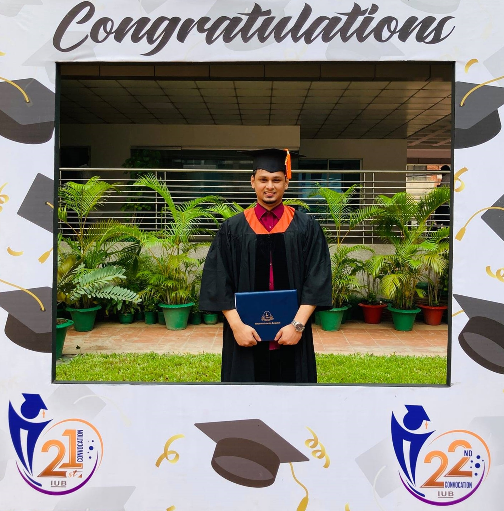

   

      

        

          <h1 class="display-4 py-4">Education, Certifications & Others Works</h1>
          
        

        

          Lorem ipsum dolor sit amet consectetur adipisicing elit. Aspernatur quia sed velit dolores maxime laboriosam, expedita voluptates. Iure molestias tempore numquam non voluptates voluptatem quae. Magnam expedita adipisci optio tempora!
        

      

   

<section>
  

    

<!--headline and graduation picture start-->
      
<!--headline and graduation picture end-->

      

        

  
  <!--MSC start-->
          

            

              <svg xmlns="http://www.w3.org/2000/svg" height="1.5em" viewBox="0 0 512 512"><!--! Font Awesome Free 6.4.0 by @fontawesome - https://fontawesome.com License - https://fontawesome.com/license (Commercial License) Copyright 2023 Fonticons, Inc. --><path d="M243.4 2.6l-224 96c-14 6-21.8 21-18.7 35.8S16.8 160 32 160v8c0 13.3 10.7 24 24 24H456c13.3 0 24-10.7 24-24v-8c15.2 0 28.3-10.7 31.3-25.6s-4.8-29.9-18.7-35.8l-224-96c-8-3.4-17.2-3.4-25.2 0zM128 224H64V420.3c-.6 .3-1.2 .7-1.8 1.1l-48 32c-11.7 7.8-17 22.4-12.9 35.9S17.9 512 32 512H480c14.1 0 26.5-9.2 30.6-22.7s-1.1-28.1-12.9-35.9l-48-32c-.6-.4-1.2-.7-1.8-1.1V224H384V416H344V224H280V416H232V224H168V416H128V224zM256 64a32 32 0 1 1 0 64 32 32 0 1 1 0-64z"/></svg>
            

            

              <strong class="d-inline-block mb-2 text-primary">University of Rostock </strong>
              <h3 class="mb-0">M.Sc. Computer Science International</h3>
              
2021 - current

              <strong class="d-block mb-2 text-secondary">Specialization : Information Systems</strong>
              <strong class="d-block mb-2 text-secondary">Current semester: 4</strong>
              <strong class="d-block mb-2 text-secondary">Grade : 1.9</strong>
              <a href="https://www.informatik.uni-rostock.de/en/studium-lehre/master-studiengaenge/computer-science-international/" target=”_blank” class="btn btn-success shadow">
                Course details
              </a>
            

          

  <!--MSC start-->

  <!--BSC start-->        
          

            

              <svg xmlns="http://www.w3.org/2000/svg" height="1.5em" viewBox="0 0 512 512"><!--! Font Awesome Free 6.4.0 by @fontawesome - https://fontawesome.com License - https://fontawesome.com/license (Commercial License) Copyright 2023 Fonticons, Inc. --><path d="M243.4 2.6l-224 96c-14 6-21.8 21-18.7 35.8S16.8 160 32 160v8c0 13.3 10.7 24 24 24H456c13.3 0 24-10.7 24-24v-8c15.2 0 28.3-10.7 31.3-25.6s-4.8-29.9-18.7-35.8l-224-96c-8-3.4-17.2-3.4-25.2 0zM128 224H64V420.3c-.6 .3-1.2 .7-1.8 1.1l-48 32c-11.7 7.8-17 22.4-12.9 35.9S17.9 512 32 512H480c14.1 0 26.5-9.2 30.6-22.7s-1.1-28.1-12.9-35.9l-48-32c-.6-.4-1.2-.7-1.8-1.1V224H384V416H344V224H280V416H232V224H168V416H128V224zM256 64a32 32 0 1 1 0 64 32 32 0 1 1 0-64z"/></svg>
            

            

              <strong class="d-inline-block mb-2 text-primary">Independent University Bangladesh (IUB) </strong>
              <h3 class="mb-0">B.Sc. Computer Science</h3>
              
2014 - 2019

              <strong class="d-block mb-2 text-secondary">Major: Computer Science</strong>
              <strong class="d-block mb-2 text-secondary">Minor: Management Infomration Systems</strong>
              <strong class="d-block mb-2 text-secondary">Grade : 1.9</strong>
              <a href="http://cse.iub.edu.bd/degrees/2" target=”_blank” class="btn btn-success shadow">
                Course details
              </a>
            

          

          
  <!--BSC end-->

          

            <!--Language start-->
          

            

              

                <svg xmlns="http://www.w3.org/2000/svg" height="1.5em" viewBox="0 0 640 512"><!--! Font Awesome Free 6.4.0 by @fontawesome - https://fontawesome.com License - https://fontawesome.com/license (Commercial License) Copyright 2023 Fonticons, Inc. --><path d="M0 128C0 92.7 28.7 64 64 64H256h48 16H576c35.3 0 64 28.7 64 64V384c0 35.3-28.7 64-64 64H320 304 256 64c-35.3 0-64-28.7-64-64V128zm320 0V384H576V128H320zM178.3 175.9c-3.2-7.2-10.4-11.9-18.3-11.9s-15.1 4.7-18.3 11.9l-64 144c-4.5 10.1 .1 21.9 10.2 26.4s21.9-.1 26.4-10.2l8.9-20.1h73.6l8.9 20.1c4.5 10.1 16.3 14.6 26.4 10.2s14.6-16.3 10.2-26.4l-64-144zM160 233.2L179 276H141l19-42.8zM448 164c11 0 20 9 20 20v4h44 16c11 0 20 9 20 20s-9 20-20 20h-2l-1.6 4.5c-8.9 24.4-22.4 46.6-39.6 65.4c.9 .6 1.8 1.1 2.7 1.6l18.9 11.3c9.5 5.7 12.5 18 6.9 27.4s-18 12.5-27.4 6.9l-18.9-11.3c-4.5-2.7-8.8-5.5-13.1-8.5c-10.6 7.5-21.9 14-34 19.4l-3.6 1.6c-10.1 4.5-21.9-.1-26.4-10.2s.1-21.9 10.2-26.4l3.6-1.6c6.4-2.9 12.6-6.1 18.5-9.8l-12.2-12.2c-7.8-7.8-7.8-20.5 0-28.3s20.5-7.8 28.3 0l14.6 14.6 .5 .5c12.4-13.1 22.5-28.3 29.8-45H448 376c-11 0-20-9-20-20s9-20 20-20h52v-4c0-11 9-20 20-20z"/></svg>
              

              <h2>Language Skills</h2>
              <strong class="d-block mb-2 text-secondary">Bengali: Native</strong>
              <strong class="d-block mb-2 text-secondary">English: C1</strong>
              <strong class="d-block mb-2 text-secondary">IELTS: 7.5</strong>
              <strong class="d-block mb-2 text-secondary">German: A2</strong>

            

        

  <!--Language end-->  

  <!--work experience start-->
  

    

      

        <svg xmlns="http://www.w3.org/2000/svg" height="1.5em" viewBox="0 0 512 512"><!--! Font Awesome Free 6.4.0 by @fontawesome - https://fontawesome.com License - https://fontawesome.com/license (Commercial License) Copyright 2023 Fonticons, Inc. --><path d="M184 48H328c4.4 0 8 3.6 8 8V96H176V56c0-4.4 3.6-8 8-8zm-56 8V96H64C28.7 96 0 124.7 0 160v96H192 320 512V160c0-35.3-28.7-64-64-64H384V56c0-30.9-25.1-56-56-56H184c-30.9 0-56 25.1-56 56zM512 288H320v32c0 17.7-14.3 32-32 32H224c-17.7 0-32-14.3-32-32V288H0V416c0 35.3 28.7 64 64 64H448c35.3 0 64-28.7 64-64V288z"/></svg>
      <h2>Work Experience</h2>
      <strong class="d-block mb-2 text-primary">Intern Game Developer</strong>
      <strong class="d-block mb-2 text-primary">Igni Studios</strong>
      
07/05/2019 to 28/07/2019

    

  <!--work experience end-->
    

  

  

        
      

    

  

  

</section>

Worked as an intern for 4 months as a junior game developer.
Programming support: Worked alongside more experienced programmers, helping with tasks like scripting, implementing features, debugging, or optimizing code.
Documentation: Involved in writing or updating technical documentation, including code comments, design documents, or user manuals, to ensure clear communication within the team.